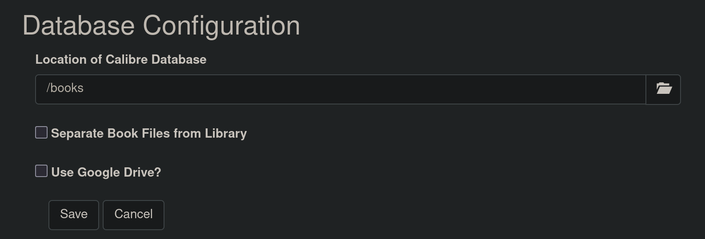
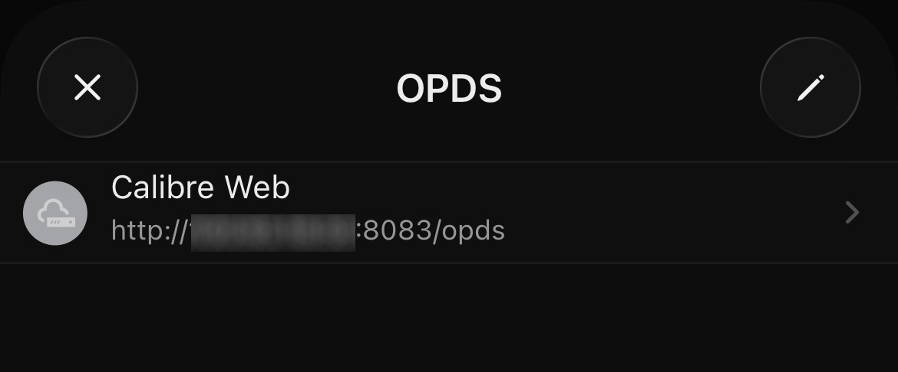
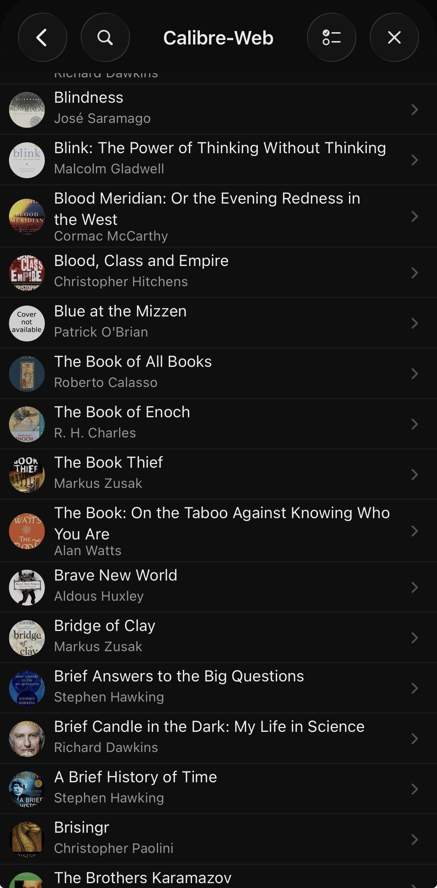

# Install Docker Engine / Docker CE
1. Follow [the Docker website's documentation](https://docs.docker.com/engine/install/#get-started), it's solid & also includes instructions to remove previous iterations of Docker on all the other supported distributions.

# Install Calibre-web via the [Docker Image](https://github.com/linuxserver/docker-calibre-web)
* **Note**: [Calibre-web](https://github.com/janeczku/calibre-web) can be installed via a python pip package, however the Docker image is easier to set up and run as a background process on a Linux server. 
1. Create a new directory for the calibre-web app to live in: 
```bash
mkdir Docker/claibre-web
cd Docker/claibre-web
```
2. Set up a docker-compose.yml file in app directory: 
```bash
touch docker-compose.yml
```
3. Ensure to make required changes to the *volumes:* section of the default docker-compose.yml: 
```bash
name: calibre-web

---
services:
  calibre-web:
    image: lscr.io/linuxserver/calibre-web:latest
    container_name: calibre-web
    environment:
      - PUID=1000
      - PGID=1000
      - TZ=Etc/UTC
      - DOCKER_MODS=linuxserver/mods:universal-calibre
    volumes:
      - /home/USER/Docker/calibre-web/config:/config
# ~/Docker/calibre-web/ will map the Calibre config directory to /config in the app directory
      - /home/USER/Documents/Books:/books 
# ~/Documents/Books = Pre-existing Calibre libary directory including metadata.db file
    ports:
      - 8083:8083
    restart: unless-stopped
```
4. Start the Calibre server: 
```bash
docker compose up -d
```

## Set-up the Calibre Library
1. From inside the server's LAN access the server via: **http://serverIP:8083**
2. Login with the default credentials: 
```bash
Username: admin
Password: admin123
```
3. When prompted set the Calibre Database Location to **/books**. Link to a pre-existing calibre libary in the **docker-compose.yml**, in the above example: **/home/USER/Documents/Books** is mapped to **/books**. 



### Access the Calibre Server Remotely
The easiest & most secure way to access the calibre-server remotely is via a VPN. [Wireguard](https://www.wireguard.com/) is very good for this, & [Tailscale](https://tailscale.com/) is an even simpler abstraction that uses Wireguard as a dependency. Full instructions for installing and configuring Tailscale can be found [here](https://makc.co/docs/simple-tailscale-setup/). 

# Using the Calibre-web OPDS Server
Maybe the best thing about the calibre-web server is the fact that it spins up an OPDS server alongside the web UI that can be accessed via many Andoid and iOS eReader apps. This server can be accessed in a browser or in an application by navigating to: **http://serverIP:8083/opds**


<p class="caption">The <a href="https://www.yomu-reader.com/" target="_blank">Yomu app</a> on iOS with the Calibre-web OPDS server linked via a Tailscale VPN connection.</p>

OPDS makes it incredibly easy to browse and download a user's full Calibre library of eBooks in any number of OPDS apps across all platforms. Some of the most popular apps are [FBReader](https://apps.apple.com/us/app/fbreader-epub-and-fb2-reader/id1067172178) on iOS, [Moon+ Reader](https://play.google.com/store/apps/details?id=com.flyersoft.moonreader) for Android & [Thorium Reader](https://thorium.edrlab.org/en/) for Linux, Windows and Apple Silicon Macs. A much larger list of OPDS applications can be found on the [Awesome OPDS GitHub page](https://github.com/opds-community/awesome-opds).


<p class="caption">My personal calibre library being accessed via the OPDS server in Yomu</p>
