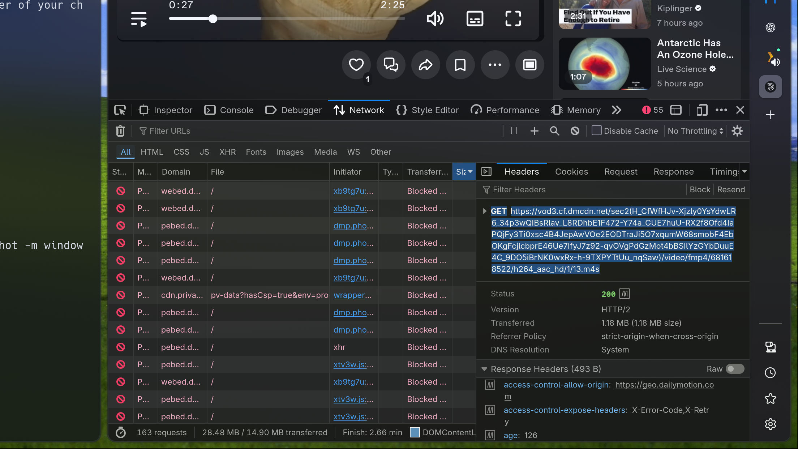

A quick guide to downloading videos that are harder than they should be to download.

## Locating a File to Download
1. Toggle *Developer Mode* in any modern full-featured browser. Developer mode can be triggered in Chromium or Firefox by pressing *F12*.
2. Swap to the *Network* tab. 
3. Reload web page if necessary and ensure video playback has been triggered.
4. Monitor for any video files, using URL filters andior the Media category in the Developer menu.
<<<<<<< HEAD
5. Select individual requests and view the headers until a url with a video file is included, the video file will often be obscured, as in the following example: `https://video.com/something.php?file=name.mp4&extra_bs`
=======
5. Select individual requests and view the headers until a url with a video file is included, the video file will often be obscured, as in the following example: `https://site.com/control.php?file=filename.mp4&acctoken=token`
>>>>>>> development



<p class="caption">
An example using the network tab in Firefox's Dev Tools to located a segmented video stream when a video starts playing on an example website.
</p>

## Downloading the Video File 
1. Using either *curl* or *wget* use the full URL to download the video file. 
```bash
<<<<<<< HEAD
curl -L -O "https://video.com/something.php?file=title.mp4&token=token"
=======
curl -L -O "https://sie.com/control.php?file=filename.mp4&acctoken=token"
>>>>>>> development
```
<p class="caption">or</p>

```bash
<<<<<<< HEAD
wget --content-disposition "https://video.com/something.php?file=title.mp4&token=token" 
=======
wget --content-disposition "https://site.com/control.php?file=filename.mp4&acctoken=token" 
>>>>>>> development
```
<p class="caption"><em>ensure quotes around the video file URL are in place</em></p>

2. Multiple attempts may be neccasary if their are multiple video files located (ads in front of video, *et cetera*), however once the curl or wget process has started the file-size is usually a pretty good giveaway (18MB vs 250MB is a pretty clear difference and easy to discriminate against). 
3. When the download is complete, often times you will be left with something other than a video file, example: *remote_control.php* would most likely be the filename if downloading a video with the previously referenced sample URL. The file-size here is once again a pretty clear give-away, as most .php files won't be several hundred megabytes. 
4. Change the file-name and extension as you will, ensuring that the .php extension is changed to a video container. I have found that *.mp4* or *.mov* will almost always result in a playable video, but depending on the format of the original file, a few tries might be necessary. In any case, simply matching the file extension of the original file should always work.

### Sequenced Videos
Some websites don't list a full video file in the Network tab of the Developer Menu. Rather than hosting a full file, it's only possible to access segmented video clips. This however does not mean that we cannot still download a full video. 

1. First find the sequence of video clips, for example the following URL might show up: `https://video.net/video.mp4/seg-01-av.ts`
2. Create a list of all segmented files, by first downloading an individual segment: 

```bash
curl -L -O "https://video.net/video.mp4/seg-01-av.ts"
```

3. Once you have one video segment, you can calculate or roughly guess the video segment in question. For example if the first segment was roughly two seconds, and the video was about thirty minutes long, we can reasonably guess that there would be about nine hundred individual segments.
4. Create a bash script to download all of the segments: 

```bash 
#!/usr/bin/env bash

BASE_URL="https://video.net/video.mp4"

for i in $(seq -w 1 900); do
    curl -L -O "$BASE_URL/seg-$i--av.ts"
done
```

5. Run the script. 
6. Add all the downloaded files into a properly organized text document. This function will organize all the files, regardless of whether or not they are numbered with proceeding zeros: 

```bash
printf '%s\n' seg-*-av.ts | sort -V | sed "s/^/file '/; s/$/'/" > files.txt
```

7. Combine all the files into one with *ffmpeg*: 

```bash
ffmpeg -f concat -safe 0 -i files.txt -c copy output.mp4
```
