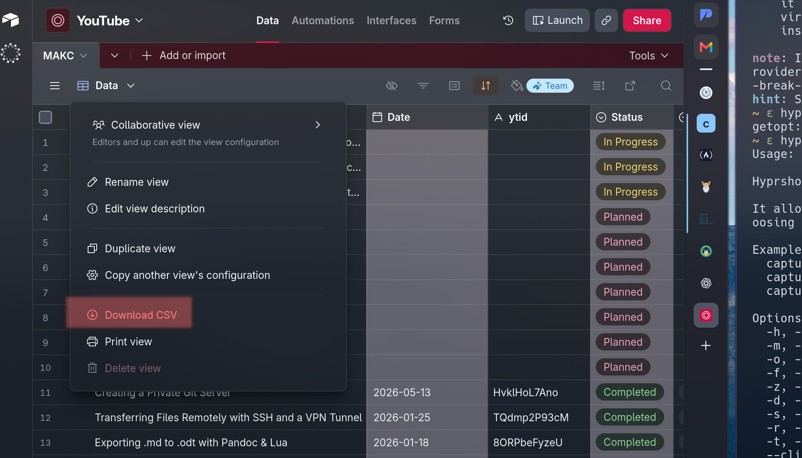
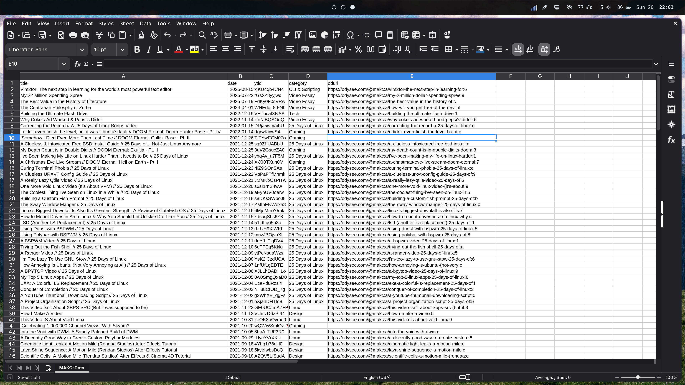
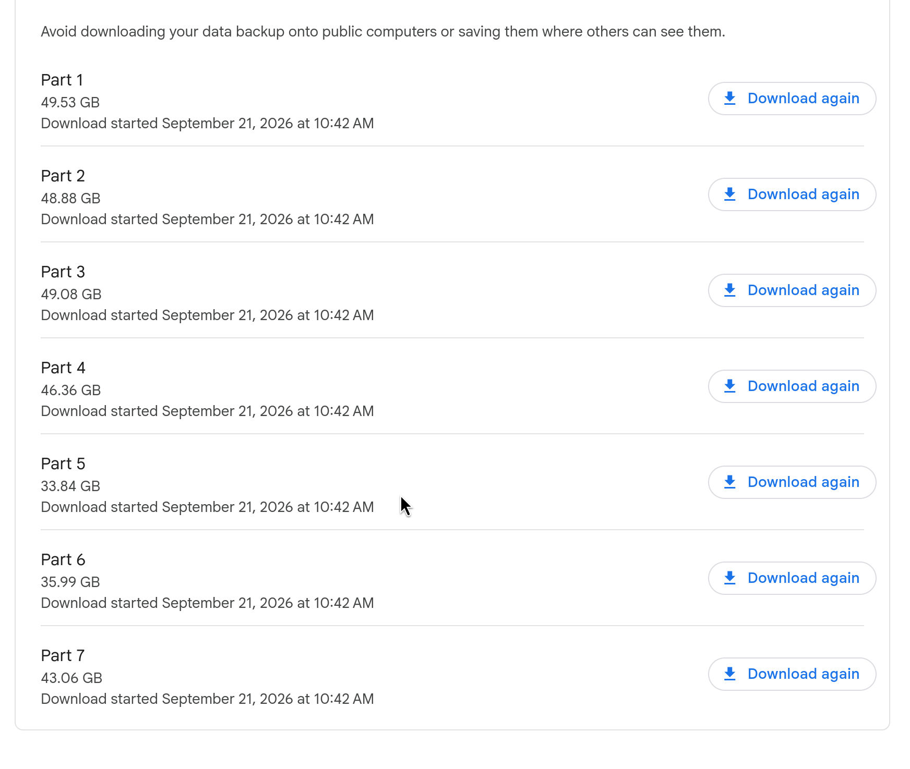
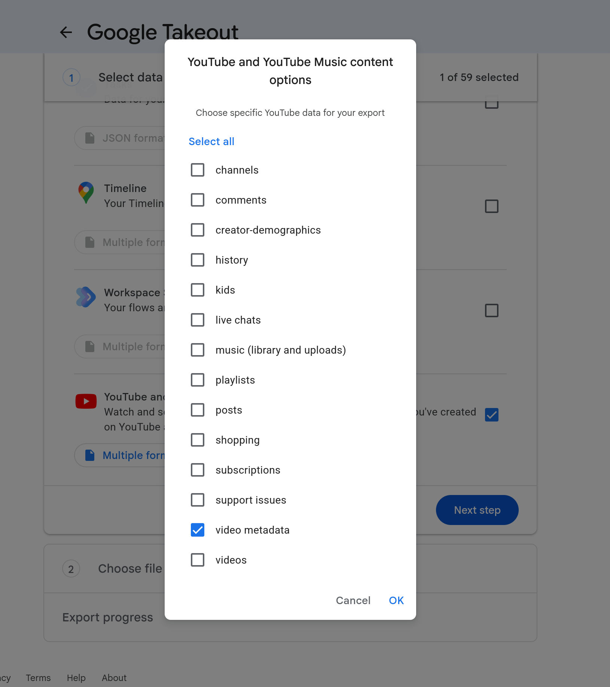

A few years ago, I began the process of rebuilding my website using the static site generator [11ty](https://11ty.dev). My goal in doing this was to create a hyper-performant version of my site that I could proudly show off on the world wide web. But I also set some fairly ambitious goals for this site, mainly to create one hub to host not only all of the [content that I've made available](https://makc.co/downloads) for public consumption, but also links to all the external content I've created. The most challenging part: my personal YouTube channel, and it's backlog of a little over two hundred videos when I started the project. Creating a website that links to YouTube would be hard enough, but around the time I started this rebuild of my site, I also decided that I needed to make sure that users could not only get links to my videos on YouTube, but also alternative platforms like [Invidious](https://invidious.io/) and [Odysse](https://odysee.com/). One database to host video metadata like title, upload date, thumbnails, tags, categories, and links to view each video in at least three different locations, was no small undertaking, but I made the job even harder by refusing to use a proper database application or CMS solution and instead insisting on using [Airtable](https://airtable.com) for the job. 

My reasoning for doing this seemed sound at the time: I had been using Airtable to keep track of my video creation pipeline for the past few years, and already had a good chunk of the videos in an Airtable base, along with much of the metadata that I wanted. Unfortunately it soon became clear that Airtable simply wasn't the right tool for the job. My Airtable integration ended up making a static site that routinely built in less than one second into a convoluted mess that had to call out to Airtable's API every time I compiled the site whether I was messing with the [video page](https://makc.co/videos) or not. Of course, Airtable as a database solution is also pretty terrible. I have used plenty of database applications in the past, and while most of them don't have the convenience of editing on a phone or in a browser like Airtable, all provide a much cleaner experience for creating and updating entries, not to mention a faster one. Airtable's website and phone apps were slow and clunky when I first started using them, but only ever got worse as Airtable, like so many others, insisted on shoving AI integration into every inch of the platform, and moved more and more features behind a paywall.

## JSON & Airtbale
So, last week I decided that I was done with Airtable, no matter the cost. The solution that I ended up wanting to try first: replacing the whole database with a single JSON file. I have plenty of familiarity with 11ty, and I knew that a JSON table would allow me to call all of the metadata that I'd need. So I created a file in `_data/videos.json`, and populated the file with a few test items: 

```json
[
    { "title": "Creating a Private Git Server",
      "date": "2026-05-13",
      "ytid": "HvklHoL7Ano",
      "category": "System Admin",
      "odurl": "https://odysee.com/@makc:a/creating-a-private-git-server:b" }, 

    { "title": "Transferring Files Remotely with SSH and a VPN Tunnel",
      "date": "2026-01-25",
      "ytid": "TQdmp2P93cM",
      "category": "System Admin",
      "odurl": "https://odysee.com/@makc:a/transferring-files-remotely-with-rsync,:6" }, 

    { "title": "Exporting .md to .odt with Pandoc & Lua",                                       
      "date": "2026-01-18",
      "ytid": "8ORPbeFyzeU",
      "category": "CLI & Scripting",
      "odurl": "https://odysee.com/@makc:a/exporting-markdown-to-openoffice-with:2" }
]
```

I was then able to easily call this JSON file on the videos page of my site with liquid: ``. I figured out that I could build (1) a link to the YouTube thumbnail, (2) a YouTube link, and (3) an Invidious link all with just a YouTube ID, so the only metadata I ended up actually needing to pull was: 

1. Video Title 
2. Upload Date
3. YouTube ID
4. Category/Topic
5. Odysee URL

From that point I could assemble the whole thing in a clean and succinct *card* that would automatically populate on my videos page with all that data I needed: 

```liquid


    <div data-category="{/{ video.category }}" class="video-card">
        <a href="https://youtube.com/watch?v={{ video.ytid }}" target="_blank" title="YouTube">
            
        </a>
        <div class='metadata'>{{ video.date | displayDate }} • {{ video.category }}</div>
        <p class="videos">{{ video.title | truncate: 42, "..." }}</p>
        <div class="platform-select">
            Watch on:  
            <a href="https://youtube.com/watch?v={{ video.ytid }}" target="_blank">YouTube, </a>
            <a href="{{ video.odurl }}" target="_blank">Odysee, </a> or
            <a href="https://inv.nadeko.net/watch?v={{ video.ytid }}" target="_blank">Invidious</a> 
        </div>
    </div>


```

**Note**: I did also create a `displayDate` filter in my Eleventy config to convert the ISO date (YYYY-MM-DD) to a more human readable format. I liked the precision of keeping the ISO format in the JSON file, even if it was just being treated as a string on build, but didn't love dates being rendered as 2026-09-05 on the live site.

```javascript
eleventyConfig.addFilter("displayDate", dateString => {
    return DateTime.fromISO(dateString).toFormat("LLLL d, yyyy");
});
```

## Creating My New Database 
Getting a JSON file to work with liquid and create dynamic HTML is only one part of the story, and, at the risk of being a bit dismissive, it's the least interesting part of it. After all, Eleventy was specifically designed to work with basically every file-type a web developer might want to work with, JSON included. What took far longer during this process, and what I found to be a much more interesting challenge, was the process of actually creating a single file that could list every single video that I've ever made and all the metadata associated with it.

### Migrating Airtable to JSON
Despite the fact that I had been using my half-assed Airtable solution for at least a year, I hadn't actually put in the work to consolidate all the metadata on the platform. However, I did manage to create Airtable entries for 176 out of the 242 videos that I have uploaded to YouTube and made public. So I wasn't exactly eager to abandon my Airtable database altogether. But I needed to get the data off of Airtable and into a format that I could manipulate. Unfortunately, the only real way to do this with Airtable was by exporting the base as a CSV file. 



<p class="caption"> 
Exporting my Airtable base as Comma Separated Values (a CSV file)
</p>

I was then able to open the CSV in Libre Office Calc and strip away all but the metadata that I actually needed. I removed all the rows containing videos that hadn't been completed yet, or that I didn't want to display on my site, and then I removed all of the columns with metadata that I didn't need. I made sure to leave the first cell in each column as a title for the field, and ended up with a clean CSV file that I could export to JSON with Python's built-in CSV library. For more details on this part, check out the [documentation](http://makc.co/docs/csv-to-json/) that I published in tandem with this essay.

``` python
python -c 
'import csv,json,sys; print(json.dumps(list(csv.DictReader(open(sys.argv[1], newline="", encoding="utf-8"))), indent=2))' 
AIRTABLE.csv > NEW.json
```



<p class="caption"> 
My cleaned up CSV file
</p>

#### Cleaning Everything Up
Of course, nothing can be as simple as it seems from the outside. I quickly noticed some weird artifacts that had made their way into my new JSON file, most notably, every `"title":` field had a string of random characters (`"\ufefftitle":`) in front of the field. Luckily, however a little bit of Vim magic was able to clean this all up. If you're unfamiliar with Vim's macros, one can record a macro by pressing: `qX` and then execute that macro *n* number of times with: `n@X`. I was able to record a macro with: `qa`, fix one field, and move the cursor to the next error, close the recording with: `q`, and then watch Vim fix the whole document with: `174@a`.

Or, if you must do things the boring way, a simple find and replace action will do the same thing: 

```vim
:%s/\ufefftitle/title/g
```

There were a few other miscellaneous artifacts that came from symbols being rendered incorrectly by the Python conversion. I found that virtually all of these artifacts could be located by searching for a preceding backslash, or a leading space after a quote. It took me no longer than a few minutes in Vim to manually fix all the weirdness and have a clean JSON file with roughly 70% of my content library ready to go.

### Google Takeout
But what to do about the remaining 30% of my video catalog? I considered just opening up Creator Studio and manually updating my JSON table. After all, I am one of those weird people who finds database creation to be a pretty calming process, even if it is comically time-consuming. But before I started to do that I remembered a little project called *Google Takeout*. A few minutes of research and I had confirmed that the same tool Google made to let users export search history and YouTube watch history could also be used to export precisely the precious metadata that I needed to build out the rest of my video catalog. Unfortunately, when I first attempted to export this data, I simply selected the *YouTube & YouTube Music* export option, which, when ready for export, gave me well over 200GiB worth of .zip files to download.



<p class="caption"> 
Google Takeout defaulting to exporting every single video I've ever uploaded, not just the metadata
</p>

Takeout, by default, will export *everything*, including a full resolution copy of every single video I've uploaded to YouTube. This is probably a good thing, based on what the tool was designed for, but it's also far from what I wanted. Fortunately I was able to backtrack and find an option in the Takeout settings that allowed me to export only *video metadata*. A few more minutes of waiting, and I had a collection of CSV files that I was able to clean up and convert to JSON via the same Python library I employed earlier. All of the metadata that I needed ended up being in the `videos.csv` file in my takeout directory, but your mileage may vary.

```bash
Takeout
│
└───YouTube and YouTube Music
    │
    └───video metadata
        │
        └───video metadata
            │ video recordings(1).csv
            │ video recordings.csv
            │ video texts(1).csv
            │ video texts.csv
            │ videos(1).csv
            │ videos.csv # <-- Contained all the metadata I needed
```


<p class="caption"> 
The option in Google Takeout to export only video metadata
</p>

#### Odysee Links & Final Steps
The final step in the process was gathering up all of the links to the remaining 80 or so videos on the Odysee platform. Odysee does provide some metadata export tools, and there's even a [channel scraper](https://apify.com/parseforge/odysee-channel-scraper) on Apify that can help out as well. However, I found it just as easy to just copy and paste the links that I was missing into the JSON file.

There was a little bit of cleanup to do after all the CSVs had been converted, and more cleanup stlll once I dropped the JSON file into my Eleventy site and started calling it on the pages where I needed to use the data. All in all, however, I ended up turning a job that I had been putting off completing for the better part of a year into something that I was able to knock out in a few hours while simultaneously being disappointed by the fourth season of [Reacher](https://www.youtube.com/watch?v=CAfVvSCCklw).
